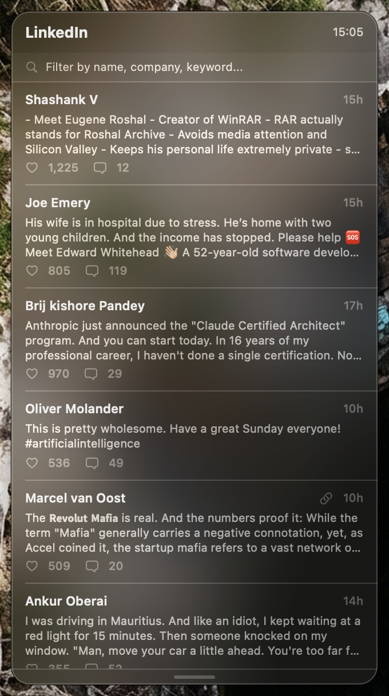

# linkedin-desktop-widget

A native macOS desktop widget that shows your LinkedIn feed at a glance. Built with SwiftUI, powered by [`linkedin-cli`](https://github.com/sderosiaux/linkedin-cli).

Floats on your desktop like a weather widget. No Dock icon, no menu bar clutter. Just a translucent panel with your most relevant posts, ranked by engagement and recency.



## Features

- **Fusion ranking** -- posts scored by `likes + comments*2 + recency_boost` (linear decay over 1 week)
- **Semantic search** -- uses Ollama embeddings for conceptual matching, with SQL fallback if Ollama is not running
- **Search results by date** -- results always sorted most recent first, with similarity percentage shown for semantic matches
- **Link indicator** -- posts containing URLs show a link icon
- **Click to open** -- click any post to open it in your browser
- **Auto-refresh** -- updates every 5 minutes from local DB (no API calls)
- **Resizable** -- drag the bottom-right corner to resize horizontally and vertically
- **Remembers position and size** across launches
- **Translucent HUD** -- native macOS vibrancy material, rounded corners
- **Desktop-level window** -- sits behind normal windows, visible on all Spaces
- **Right-click** to manually refresh or quit
- **SwiftLint enforced** -- strict linting with opt-in rules

## Prerequisites

- macOS 14+
- Swift 5.9+
- [`linkedin-cli`](https://github.com/sderosiaux/linkedin-cli) installed via bun
- A populated local database (`linkedin sync` run at least once)
- [Ollama](https://ollama.com) with `nomic-embed-text` (optional, for semantic search)

## Install

```bash
git clone https://github.com/sderosiaux/linkedin-desktop-widget.git
cd linkedin-desktop-widget
swift build -c release
```

The binary is at `.build/release/LinkedInWidget`.

## Usage

```bash
# Run the widget
.build/release/LinkedInWidget

# Or install globally
cp .build/release/LinkedInWidget ~/.local/bin/
```

The widget appears in the top-right corner of your screen. Drag to reposition. Drag the bottom-right corner to resize.

There is no Dock icon. Right-click the widget to quit, or use `pkill LinkedInWidget`.

### Search

Type in the search bar to find posts. If Ollama is running with embeddings generated (`linkedin embed`), the widget uses semantic search to find conceptually related posts. Otherwise, it falls back to SQL text matching against post content, author names, and headlines.

### Keeping data fresh

The widget reads from `linkedin-cli`'s local SQLite database. It never calls the LinkedIn API directly. To keep your data fresh, run `linkedin sync` periodically:

```bash
# Manual sync
linkedin sync

# Or via cron (every 30 minutes)
crontab -e
*/30 * * * * /Users/you/.bun/bin/linkedin sync
```

### Launch at login

Add the built binary to **System Settings > General > Login Items**, or create a Launch Agent:

```bash
cat > ~/Library/LaunchAgents/com.linkedin-widget.plist << 'EOF'
<?xml version="1.0" encoding="UTF-8"?>
<!DOCTYPE plist PUBLIC "-//Apple//DTD PLIST 1.0//EN" "http://www.apple.com/DTDs/PropertyList-1.0.dtd">
<plist version="1.0">
<dict>
    <key>Label</key>
    <string>com.linkedin-widget</string>
    <key>ProgramArguments</key>
    <array>
        <string>/path/to/LinkedInWidget</string>
    </array>
    <key>RunAtLoad</key>
    <true/>
</dict>
</plist>
EOF

launchctl load ~/Library/LaunchAgents/com.linkedin-widget.plist
```

## Project structure

```
Package.swift              # SPM manifest, macOS 14+
.swiftlint.yml             # Strict lint rules
Sources/
  main.swift               # App entry point
  AppDelegate.swift        # Window setup (borderless, translucent, desktop-level)
  Models.swift             # Post model, ranking, date sorting
  LinkedInService.swift    # Runs linkedin-cli, semantic + SQL search, caches results
  WidgetStore.swift        # Observable state (posts, search query, refresh)
  WidgetView.swift         # Main widget layout (header, search, post list)
  PostRow.swift            # Individual post row with similarity badge
  ResizableWindow.swift    # NSWindow subclass with corner resize
  ResizeHandle.swift       # Corner resize grip indicator
```

## License

MIT
